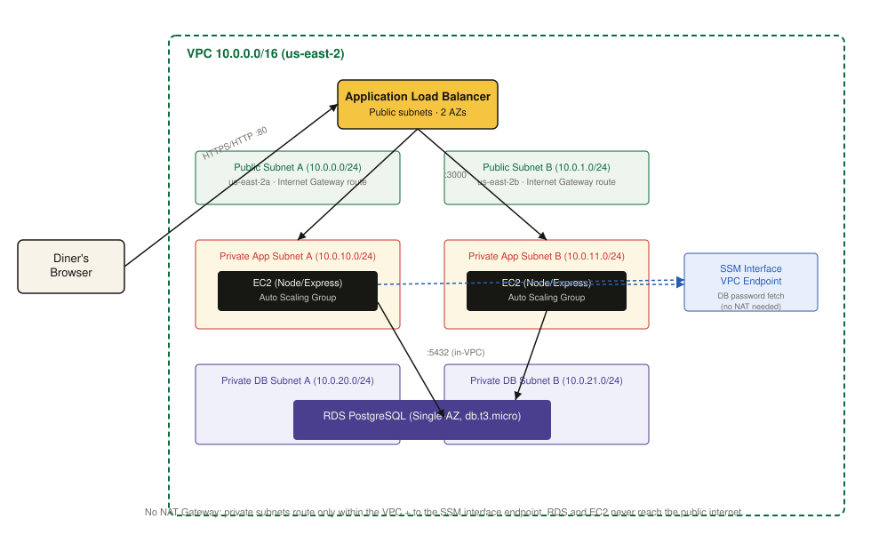

# Spice Route Kitchen — Classic 3-Tier AWS Web App

A fictional Guyanese & Caribbean restaurant site (Spice Route Kitchen, Queens NY),
built with a live table-reservation feature and deployed on a classic 3-tier
AWS architecture — VPC with public/private subnets across two AZs, an Auto
Scaling Group of EC2 instances behind an Application Load Balancer, and a
PostgreSQL database on RDS.

This project intentionally does **not** use serverless services (Lambda/API
Gateway/DynamoDB) — it's the networking/high-availability counterpart to a
serverless project in the same portfolio, built to demonstrate VPC design,
load balancing, EC2 Auto Scaling, and RDS.

## Live demo

_Add your ALB DNS name here once deployed, e.g. `http://spiceroute-alb-123456789.us-east-2.elb.amazonaws.com`_

## Architecture



- **VPC** (`10.0.0.0/16`, `us-east-2`) with 2 public subnets, 2 private "app"
  subnets, and 2 private "db" subnets across two Availability Zones.
- **Application Load Balancer** in the public subnets, internet-facing.
- **EC2 Auto Scaling Group** (min 2 / max 4) running a Node.js/Express app in
  the private app subnets — no public IPs, no direct internet access.
- **RDS for PostgreSQL** in the private db subnets, reachable only from the
  app tier's security group.
- **No NAT Gateway.** The app tier only needs to reach RDS (same VPC — no
  internet required) and AWS Systems Manager Parameter Store (via a single
  SSM interface VPC endpoint) to fetch its database credential at boot. This
  cuts the usual ~$32-35/month NAT Gateway cost down to roughly one interface
  endpoint's cost while keeping the app and database tiers fully private.
- **Least-privilege throughout:** the EC2 instance role can only read one
  specific SSM parameter and decrypt it — nothing else. The app connects to
  RDS as a dedicated low-privilege database user, never as the RDS master
  admin.

## Tech stack

- **Frontend:** static HTML/CSS (served by the app tier) with a vanilla-JS
  reservation form.
- **Backend:** Node.js + Express (`app/server.js`).
- **Database:** PostgreSQL on Amazon RDS.
- **Secrets:** AWS Systems Manager Parameter Store (SecureString), fetched at
  app startup via the EC2 instance's IAM role — never stored in the AMI,
  launch template, or source code.

## What this demonstrates

- VPC design: public/private subnet separation, route tables, an internet
  gateway for the public tier only, and a cost-conscious NAT-free private
  tier using a VPC interface endpoint.
- High availability: an Application Load Balancer and Auto Scaling Group
  spanning two Availability Zones, with a target-tracking scaling policy.
- Secure secrets management: no plaintext credentials anywhere in the AMI or
  code — the app fetches its DB password from Parameter Store at runtime
  using scoped IAM permissions.
- A "golden AMI" build pattern: the app is baked into a custom AMI on a
  temporary internet-connected builder instance, then launched into fully
  private subnets with no internet access at all.
- Least-privilege IAM and least-privilege database access, applied at every
  layer (EC2 instance role, SSM parameter scope, database user grants).

## Repo layout

```
app/                  Node/Express application
  server.js           App server + reservations API
  public/              Static site (HTML/CSS/JS + restaurant photos)
  db/schema.sql        Reservations table DDL
  package.json
  .env.example         Local dev config (see below)
docs/
  architecture-diagram.svg
aws-console-steps.md   Full step-by-step AWS Console deployment guide
```

## Running locally

```bash
cd app
npm install
cp .env.example .env    # set DB_PASSWORD and DB_SSL=false for local Postgres
npm start
```

## Deploying to AWS

See [`aws-console-steps.md`](./aws-console-steps.md) for the full, phase-by-phase
AWS Console walkthrough (VPC → RDS → golden AMI → launch template → ALB →
Auto Scaling Group), plus a cost breakdown and teardown instructions.
